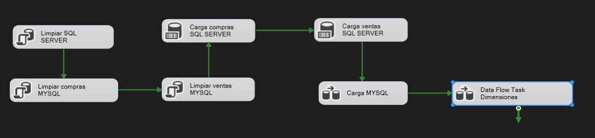
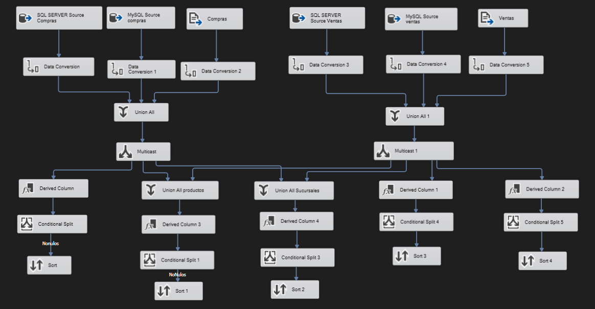
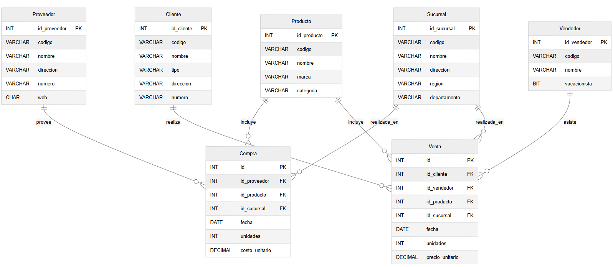

# Carga y Transformación de Datos de Ventas y Compras

### Christopher Iván Monterroso Alegria

### 201902363

## 

### **Objetivo**

Integrar los datos provenientes de archivos planos (`ventas_temp` y `compras_temp`) en sistemas de bases de datos SQL Server y MySQL, aplicando transformaciones para generar las dimensiones del modelo de datos.

### **Descripción del flujo principal (control flow)**

1. **Limpiar SQL Server**
   * Ejecuta `TRUNCATE TABLE` en todas las tablas destino de SQL Server.
2. **Limpiar compras y ventas en MySQL**
   * Ejecuta `TRUNCATE TABLE` para `compras_temp` y `ventas_temp`.
3. **Carga de archivos a SQL Server**
   * Utiliza tareas `Bulk Insert` para insertar los archivos a tablas temporales en SQL Server.
4. **Carga de archivos a MySQL**
   * Mediante `Script Component` (Destino), se cargan los mismos archivos a `compras_temp` y `ventas_temp` en MySQL.
5. **Data Flow Task: Dimensiones**
   * Toma los datos de las tablas temporales y los transforma en dimensiones limpias y normalizadas: `Cliente`, `Proveedor`, `Producto`, `Sucursal`, `Vendedor`.

### **Detalle del flujo de transformación (`Data Flow Task: Dimensiones`)**

#### Entradas:

* `compras_temp` (MySQL)
* `ventas_temp` (MySQL)

#### Transformaciones:

* `Union All`: une datos de ambos orígenes.
* `Derived Column`: genera claves compuestas, transforma texto y normaliza valores.
* `Sort` y `Aggregate`: remueve duplicados y agrupa dimensiones.
* `Lookup`: puede usarse para evitar duplicidad antes de insertar.

#### Salidas:

* `Cliente`, `Proveedor`, `Producto`, `Sucursal`, `Vendedor`: tablas dimensionales en MySQL.
  

## **Modelo de Datos del Data Warehouse**

### Propósito

El presente modelo representa la estructura del **Data Warehouse** implementado como parte del proceso de integración y análisis de datos de compras y ventas. El modelo está diseñado para facilitar el análisis histórico, la generación de reportes, y la toma de decisiones basada en datos.

### Tipo de modelo: Modelo Dimensional en Estrella (Star Schema)

El modelo sigue la arquitectura **estrella**, caracterizada por:

* Una o más **tablas de hechos** en el centro.
* Varias **tablas de dimensiones** conectadas directamente a las tablas de hechos.
* Estructura optimizada para consultas analíticas y agregaciones.

### Componentes del modelo

#### Tablas de dimensiones

Las tablas de dimensiones almacenan información descriptiva sobre las entidades involucradas en las transacciones:

* **Cliente:** datos del cliente como código, nombre, tipo, dirección y número de contacto.
* **Proveedor:** información de proveedores, incluyendo código, nombre, dirección, contacto y sitio web.
* **Producto:** detalles del producto como código, nombre, marca y categoría.
* **Sucursal:** ubicación física donde se realiza la compra o venta, con datos como región y departamento.
* **Vendedor:** personal encargado de las ventas, indicando si es un vacacionista.

Estas dimensiones permiten realizar análisis como ventas por región, productos más vendidos, o rendimiento por vendedor.

#### Tablas de hechos

Las tablas de hechos contienen los registros transaccionales con métricas cuantitativas (como unidades o montos):

* **Compra:**
  * Registra cada compra realizada a un proveedor.
  * Métricas: `unidades`, `costo_unitario`.
  * Claves foráneas: `id_proveedor`, `id_producto`, `id_sucursal`.
* **Venta:**
  * Registra cada venta realizada a un cliente.
  * Métricas: `unidades`, `precio_unitario`.
  * Claves foráneas: `id_cliente`, `id_vendedor`, `id_producto`, `id_sucursal`.

Ambas tablas comparten la dimensión `Producto` y `Sucursal`, lo que permite comparaciones entre compras y ventas por producto o ubicación.

### 🔗 Relación entre tablas

Cada tabla de hechos se relaciona directamente con las dimensiones mediante claves foráneas. Esto permite realizar análisis combinando métricas de hechos con atributos descriptivos de las dimensiones.

Por ejemplo:

* Total de unidades vendidas por tipo de cliente.
* Promedio de costo unitario por proveedor.
* Comparación de ventas vs compras por producto.

### Aplicaciones del modelo

Este Data Warehouse está preparado para ser consumido por herramientas de Business Intelligence (BI) como Power BI, Tableau o Excel, permitiendo la creación de:

* Dashboards gerenciales.
* Reportes de rendimiento comercial.
* Análisis de tendencias y proyecciones.

